# เพิ่มเติม
## ความต้องการของระบบ
- Python3.10 ขึ้นไป
    <br/>ดาวน์โหลดได้ที่ : https://www.python.org/downloads/
- fastapi
    ```
    pip install fastapi
    ```
- uvicorn
    ```
    pip install uvicorn[standard]
    ```
- python-multipart
    ```
    pip install python-multipart
    ```
- pyngrok
    ```
    pip install pyngrok
    ```
- pandas
    ```
    pip install pandas
    ```
- requests
    ```
    pip install requests
    ```

## การรับNgrok Token
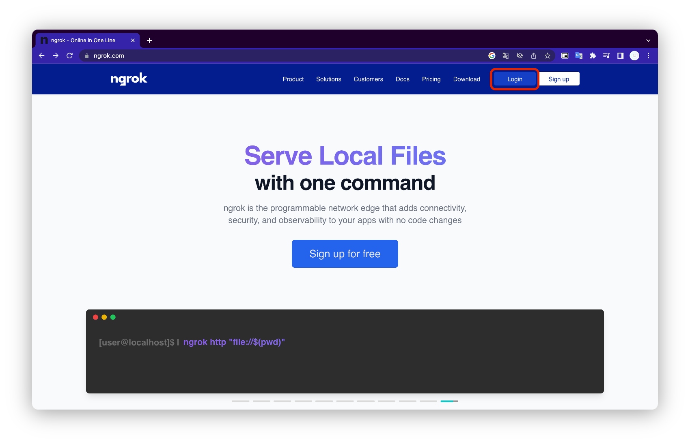
เข้าเว็บ https://ngrok.com/ แล้วล็อกอินให้เรียบร้อย

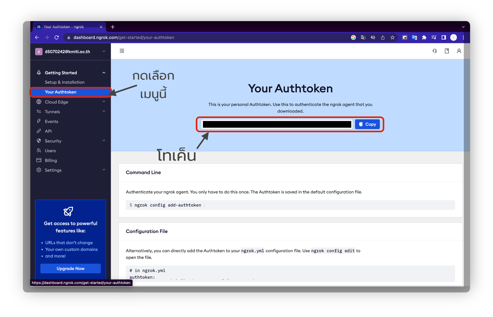
เลือกเมนู Your Authtoken

คัดลอกTokenมาเพื่อใช้

## การซ่อมแซมไฟล์ที่หาย
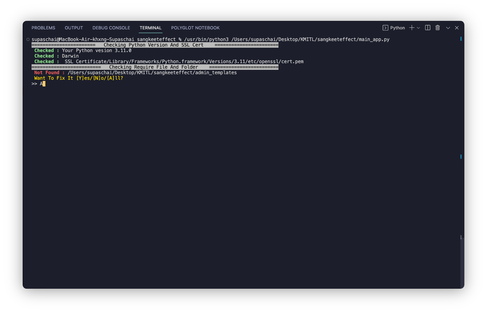
ก่อนรับแอปจะมีการตรวจสอบสิ่งที่จำเป็นในการรันเสมอ
ถ้าตรวจพบว่าขาดไฟล์ เทอมินอลจะถามว่าต้องการแก้ไขหรือไม่
การแก้ไขจะโหลดไฟล์จากGithubมาทดแทนไฟล์ที่ศูนย์หาย(ใช้ได้เฉพาะadmin_templates)
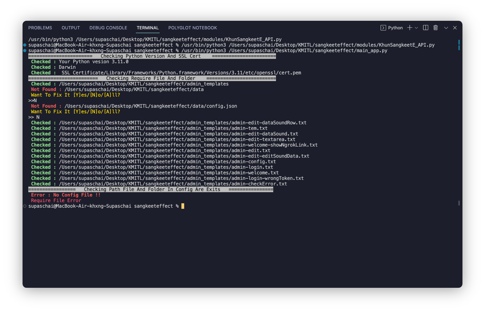
ถ้าหากไม่ยอมไฟล์Appจะไม่ทำงาน

## การถูกจำกัดฟังก์ชั่นการใช้งาน(เกิดขึ้นได้เฉพาะMac OS)
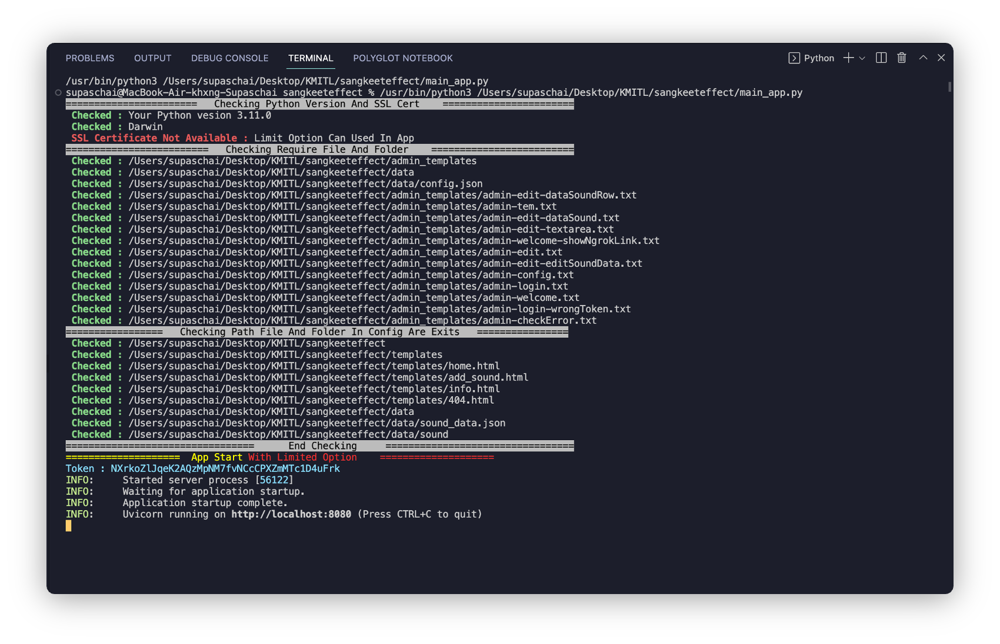
การถุกจำกัดOption(การใช้งานโหมดเก็บข้อมูลแบบ  Storage With Gsheet แล การใช้งาน Ngrok)

## การแก้ปัญหาเมื่อหน้าHomeไม่ขึ้นข้อมูลอะไร
โปรดตรวจสอบให้แน่ใจว่าได้ทำการเพิ่มเสียงและข้อมูลเสียงเข้าไปหรือยัง
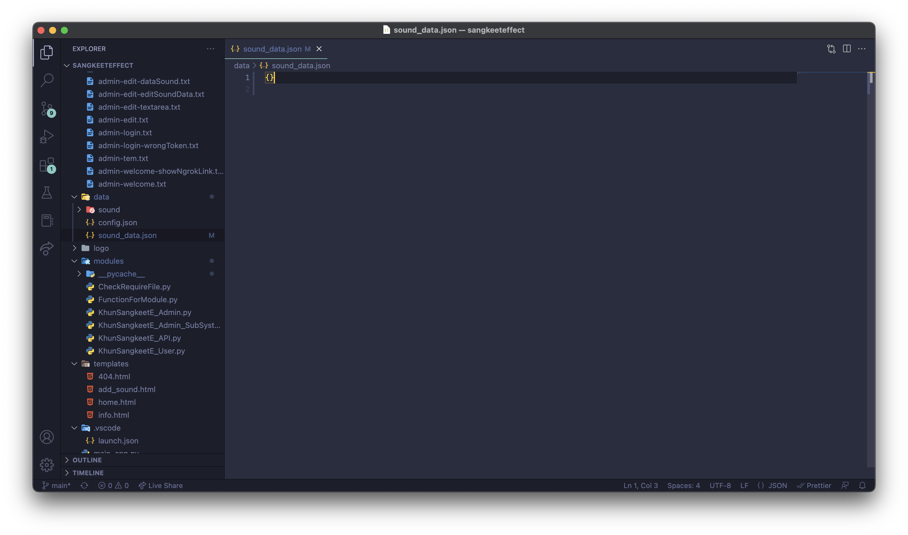

## การแก้ปัญหาถูกLimit Optionใน Mac
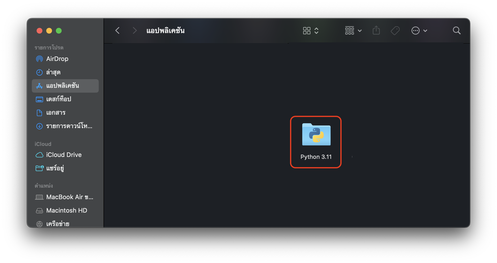
หาโฟเดอร์Pythonที่ใช้อยู่แล้วคลิกเข้าไปในโฟรเดอร์
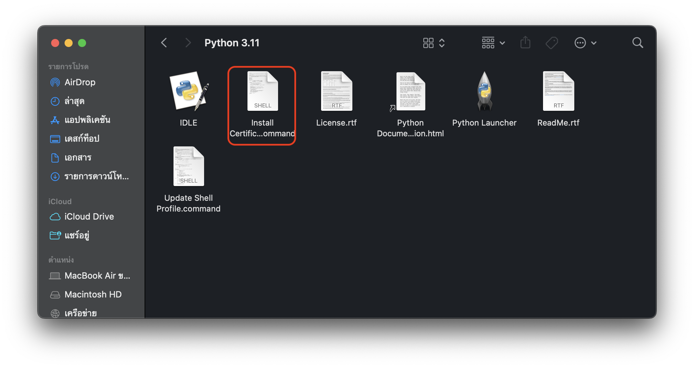
รันไฟล์ `Install Certificates.command`
```
#!/bin/sh

/Library/Frameworks/Python.framework/Versions/3.11/bin/python3.11 << "EOF"

# install_certifi.py
#
# sample script to install or update a set of default Root Certificates
# for the ssl module.  Uses the certificates provided by the certifi package:
#       https://pypi.org/project/certifi/

import os
import os.path
import ssl
import stat
import subprocess
import sys

STAT_0o775 = ( stat.S_IRUSR | stat.S_IWUSR | stat.S_IXUSR
             | stat.S_IRGRP | stat.S_IWGRP | stat.S_IXGRP
             | stat.S_IROTH |                stat.S_IXOTH )

def main():
    openssl_dir, openssl_cafile = os.path.split(
        ssl.get_default_verify_paths().openssl_cafile)

    print(" -- pip install --upgrade certifi")
    subprocess.check_call([sys.executable,
        "-E", "-s", "-m", "pip", "install", "--upgrade", "certifi"])

    import certifi

    # change working directory to the default SSL directory
    os.chdir(openssl_dir)
    relpath_to_certifi_cafile = os.path.relpath(certifi.where())
    print(" -- removing any existing file or link")
    try:
        os.remove(openssl_cafile)
    except FileNotFoundError:
        pass
    print(" -- creating symlink to certifi certificate bundle")
    os.symlink(relpath_to_certifi_cafile, openssl_cafile)
    print(" -- setting permissions")
    os.chmod(openssl_cafile, STAT_0o775)
    print(" -- update complete")

if __name__ == '__main__':
    main()
EOF

```
## การสร้างเก็บข้อมูลกับGoogle Sheet และ Google Form
### การสร้างGoogle Form สำหรับใช้กับแอป
ให้สร้างตามรายละเอียดดั่งต่อไปนี้
ช่องสำหรับเก็บชื่อของเสียงให้ตั้งคำถามด้วยคำว่า`Sound Name`
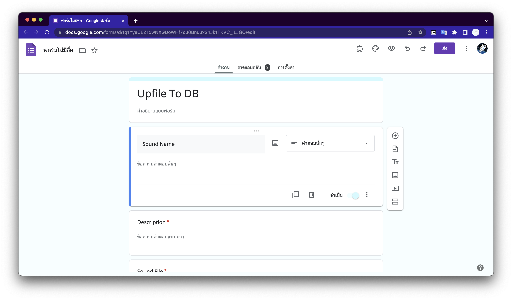
ช่องสำหรับคำอธิบายรายละเอียดของเสียงให้ตั้งคำถามด้วยคำว่า`Description`
และ ช่องสำหรับไฟล์เสียงให้ตั้งคำถามด้วยคำว่า`Sound File`
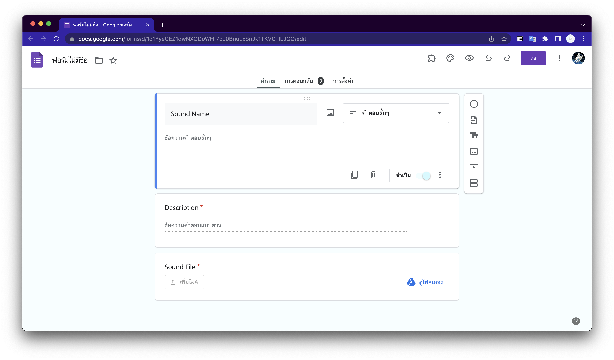
## การเอาCSVจากGoogle Sheet
1. เลือกที่เมนูไฟล์
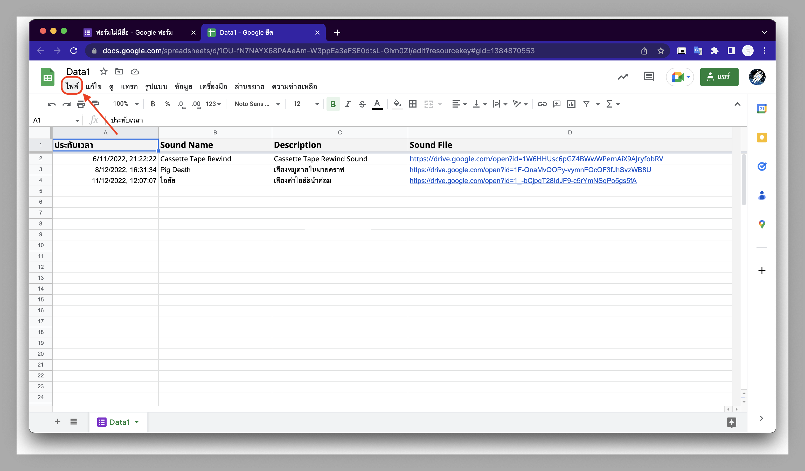
2. เลือกเมยูแชร์แล้วเลือกเผยแพร์ไปยังเว็บ
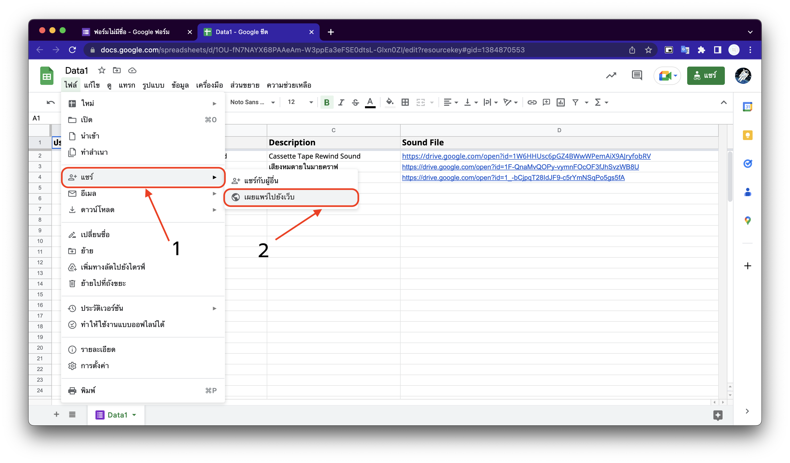
3. เลือกเฉพาะหน้าที่ใช้เก็บข้อมูลเสียง
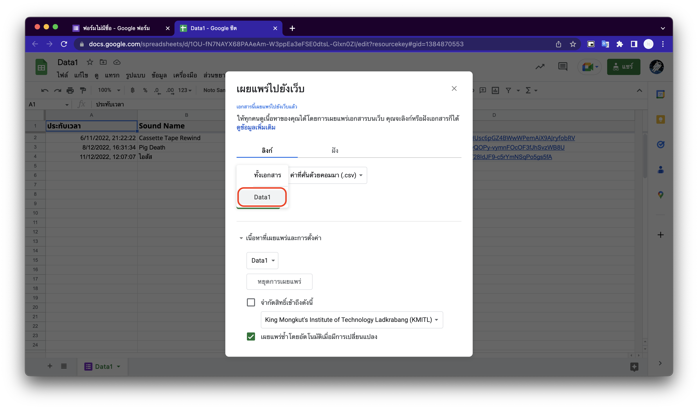
4. เลือกค่าที่คั่นด้วยคอมมา(.csv) แล้วกดเผยแพร่
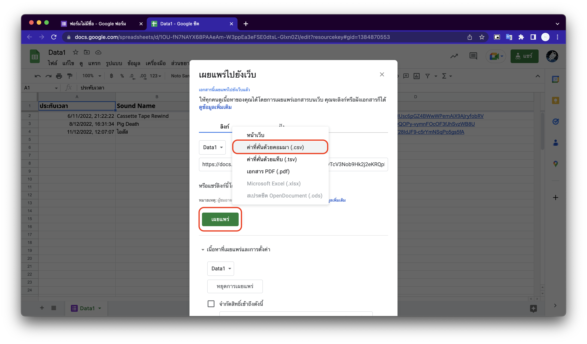
5. คัดลอกลิงค์มาใช้งาน
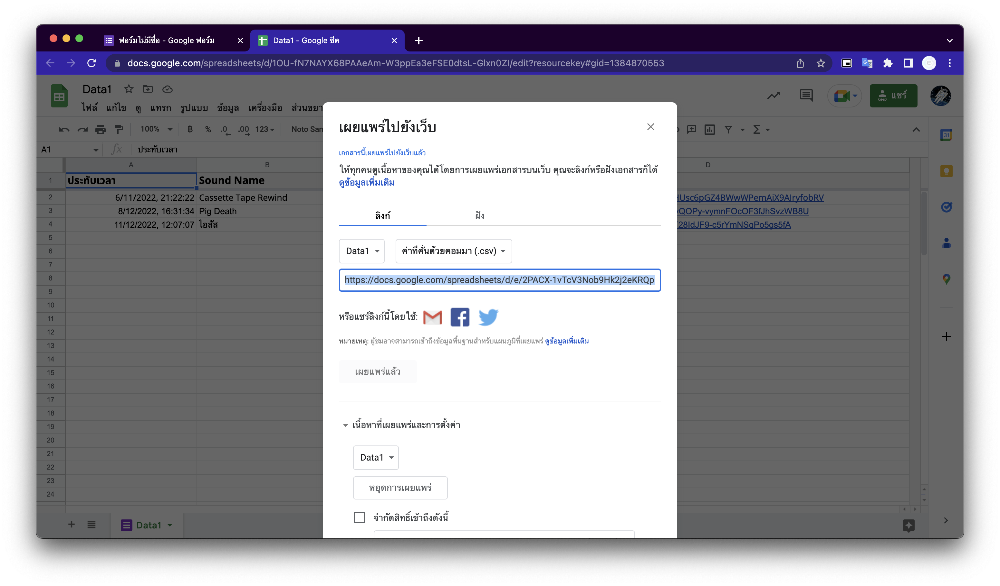

## การรับwebhookของDiscord
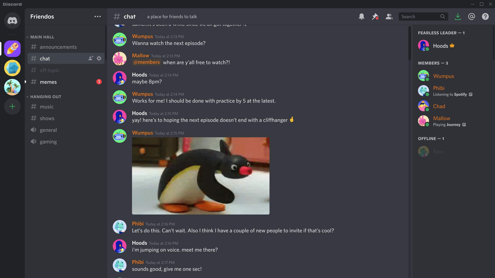
ดูข้อมูลได้ที่ [วิธีการนำ webhook ของ channel ออกมา
](https://www.mikkipastel.com/discord-bot-webhook-and-cronjob/)

## การสร้างเทมเพลตใช้งานเอง
### หน้า Home
ใส่`/*soundData*/`ในที่ต้องการให้เสียงปรากฏ บนไฟล์HTML

และใส่ Tag ด้านล่างนี้ลงในส่วนHead
```html
<link rel="preconnect" href="https://fonts.gstatic.com" crossorigin>
<link href="https://fonts.googleapis.com/css2?family=Srisakdi&display=swap" rel="stylesheet">
<link rel="stylesheet" href="https://fonts.googleapis.com/css2?family=Material+Symbols+Outlined:opsz,wght,FILL,GRAD@48,400,0,0" />
```
และใส่ Tag ด้านล่างนี้ลงในส่วนก่อนที่จะถึงTagปิดของBody
```html
<script>
    let before = ""
    function togglePlay(xx,path){
        let au = document.getElementById("au")
        if(before == xx){
        au.innerHTML = ""
        document.getElementById(xx).style.border = ""
        before = ""
        return 0
        }
        au.innerHTML = "<audio loop src='"+path+"' id='au"+xx+"'></audio>"
        document.getElementById("au"+xx).play()
        if(before != ""){
            document.getElementById(before).style.border = "";
        }
        document.getElementById(xx).style.border = "solid 2px"

        before = xx
        
    }
</script>
```
**ตัวอย่าง ข้อมูลจะปรากฎมาในรูปแบบนี้ แทนที่`/*soundData*/`เมื่อรันแอปแล้ว
```html
<div class="card" id="{_id}" onclick="togglePlay('{_id}','/stream/sound/{_id}')">
    <center>
        <span class="material-symbols-outlined" style="font-size: 100px;font-weight: 1500; color: grey">
         music_note
        </span>
        <p>
            {ชื่อเสียง}
            <a href="/info/{_id}">
                <span class="material-symbols-outlined">
                    info
                </span>
            </a>
        </p>
    </center>
</div>
```
**ตัวอย่างการใช้
```html
<!DOCTYPE html>
<html lang="en">
<head>
    <meta charset="UTF-8">
    <meta http-equiv="X-UA-Compatible" content="IE=edge">
    <meta name="viewport" content="width=device-width, initial-scale=1.0">
    <title>Sample</title>
    <link rel="preconnect" href="https://fonts.gstatic.com" crossorigin>
<link href="https://fonts.googleapis.com/css2?family=Srisakdi&display=swap" rel="stylesheet">
<link rel="stylesheet" href="https://fonts.googleapis.com/css2?family=Material+Symbols+Outlined:opsz,wght,FILL,GRAD@48,400,0,0" />
</head>
<body>
    /*soundData*/
    <script>
    let before = ""
    function togglePlay(xx,path){
        let au = document.getElementById("au")
        if(before == xx){
        au.innerHTML = ""
        document.getElementById(xx).style.border = ""
        before = ""
        return 0
        }
        au.innerHTML = "<audio loop src='"+path+"' id='au"+xx+"'></audio>"
        document.getElementById("au"+xx).play()
        if(before != ""){
            document.getElementById(before).style.border = "";
        }
        document.getElementById(xx).style.border = "solid 2px"

        before = xx
        
    }
</script>
</body>
</html>
```

### หน้าInfo
ใส่`/*soundName*/`ในที่ต้องการให้ชื่อของเสียงปรากฏ, `/*description*/`ที่ต้องการให้คำอธิบายของเสียงปรากฏ และ `<audio src="/*link*/" controls></audio>`ที่ต้องการให้ไฟล์เสียงปรากฏ บนไฟล์HTML

**ตัวอย่างการใช้
```html
<!DOCTYPE html>
<html lang="en">
    <head>
        <meta charset="UTF-8" />
        <meta http-equiv="X-UA-Compatible" content="IE=edge" />
        <meta name="viewport" content="width=device-width, initial-scale=1.0" />
        <title>Sample</title>
    </head>
<body>
    <center>
        <div class="box">
            <h1>/*soundName*/</h1>
            
            <audio src="/*link*/" controls></audio>
            <div>
                <h2>Description</h2>
                <p>
                /*description*/
                </p>
            </div>
        </div>
        </center>
  </body>
</html>

```
### หน้า Add_Sound
ต้องมี ช่องinputดังนี้ในฟอร์ม
+ `<input name="_id" readonly value="/*id*/" required />` สำหรับการสร้างId(ผู้ไม่ต้องกรอก ระบบกรอกให้อัตโนมัติ)
+ `<input name="soundName" />` สำหรับใส่ชื่อเสียง
+ `<input name="soundFile" type="file" accept=".mp3"  />` สำหรับใส่ไฟล์เสียง
+ `<textarea name="description" required></textarea>`สำหรับเขียนคำอธิบายเสียง
**ตัวอย่างการใช้
```html
<!DOCTYPE html>
<html lang="en">
<head>
    <meta charset="UTF-8">
    <meta http-equiv="X-UA-Compatible" content="IE=edge">
    <meta name="viewport" content="width=device-width, initial-scale=1.0">
    <title>Sample</title>
</head>
<body>
    <form method="post" enctype="multipart/form-data" >
        <label>Id</label>
        <input name="_id" readonly value="/*id*/" required />
        <label>ชื่อของเสียง</label>
        <input class="input" name="soundName" />
        <label>ไฟล์เสียง</label>
        <input class="input" name="soundFile" type="file" accept=".mp3"  />
        <label>คำอธิบายรายละเอียดของเสียง</label>
        <textarea name="description" required></textarea>
        <input type="submit" />
    </form>
</body>
</html>
```
## หน้า 404
ใช้การใส่ไฟล์Htmlปกติได้เลย

**ตัวอย่างการใช้

```html
<!DOCTYPE html>
<html lang="en">
<head>
    <meta charset="UTF-8">
    <meta http-equiv="X-UA-Compatible" content="IE=edge">
    <meta name="viewport" content="width=device-width, initial-scale=1.0">
    <title>Sample</title>
</head>
<body>
    <h1>404 File Not Found</h1>
</body>
</html>

```

## การConfigในไฟล์Jsonโดยตรงเบื้องต้น
ต้องทำก่อนรันAppจะดีที่สุด
```
{
  "host": "{ที่อยู่ของ Host}",
  "port": "{พอร์ตที่ใช้รันแอป}",
  "parent path": "{pathแม่ของTemplatedata}",
  "template": {
    "home": "{ไฟล์htmlที่ต้องการให้เป็นหน้าhome}",
    "add_sound": "{ไฟล์htmlที่ต้องการให้เป็นหน้าadd_sound}",
    "info": "{ไฟล์htmlที่ต้องการให้เป็นหน้าinfo}",
    "err404": "{ไฟล์htmlที่ต้องการให้เป็นหน้า404}"
  },
  "ngrok": {
    "on": 0,
    "token": "{TokenของNgrok}"
  },
  "local_storage": {
    "on": {0(ปิด) หรือ 1(เปิด) โหมดการเก็บข้อมูลภายในเครื่อง},
    "sound data": "{pathไฟล์ที่เก็บข้อมูลรายบะเอียดเสียงเป็นjson}",
    "sound path": "{pathโฟเดอร์ที่เก็บไฟล์เสียง}"
  },
  "with_gform_and_gsheet": {
    "on": {0(ปิด) หรือ 1(เปิด) โหมดการเก็บข้อมูลกับGoogle Sheet},
    "form_link": "{ลิงค์Google Formรับข้อมูลและไฟล์เสียง}",
    "sheet_link": "{ลิงค์Google Sheet}",
    "csv_link": "{ลิงค์Google Sheet แบบเผยแพร่เป็นcsv}"
  },
  "send_token_to_discord": {
    "on": 0(ปิด) หรือ 1(เปิด) การส่งTokenเข้าDiscord},
    "webhook_url": "WebHook Api Link ของ Discord"
  }
}
```
## FrameWork และ Plugin ที่ใช้
+ Fastapi [FastAPI is a modern, fast (high-performance), web framework for building APIs with Python 3.7+ based on standard Python type hints...
](https://fastapi.tiangolo.com/)
+ Uvicorn [Uvicorn is an ASGI web server implementation for Python...](https://www.uvicorn.org/)
+ Python-Multipart [Python-Multipart is a streaming multipart parser for Python...](https://andrew-d.github.io/python-multipart/)
+ Ngrok [ngrok is the programmable network edge that adds connectivity,
security, and observability to your apps with no code changes..](https://ngrok.com/)
+ Pandas [pandas is a fast, powerful, flexible and easy to use open source data analysis and manipulation tool,
built on top of the Python programming language...](https://pandas.pydata.org/)
+ Requests [Requests is an elegant and simple HTTP library for Python, built for human beings.](https://requests.readthedocs.io/en/latest/)
+ Google Font, Google Material Symbols [Google Fonts is a library of 1474 open source font families and APIs for convenient use via CSS and Android. The library also has delightful and beautifully crafted icons for common actions and items. Download them for use in your digital products for Android, iOS, and web...](https://fonts.google.com/knowledge)
+ Bootstrap [Build fast, responsive sites with Bootstrap...](https://getbootstrap.com/)
+ Bulma [Bulma: the modern CSS framework that just works...](https://bulma.io/)
+ SunEditor [Pure javascript based WYSIWYG html editor, with no dependencies...](http://suneditor.com/sample/index.html)
+ Animate.css [Animate.css is a library of ready-to-use, cross-browser animations for use in your web projects. Great for emphasis, home pages, sliders, and attention-guiding hints.](https://animate.style/)


